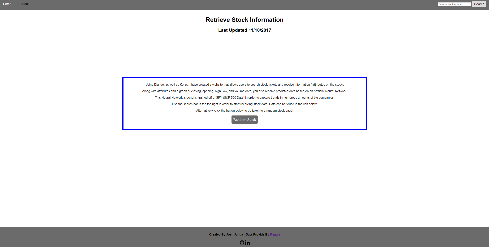
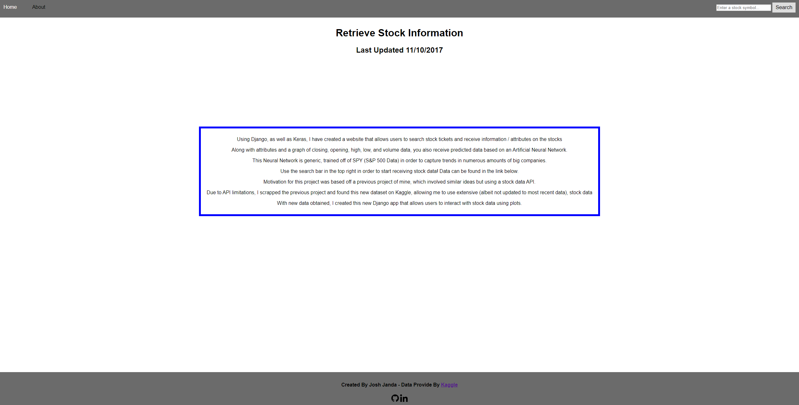
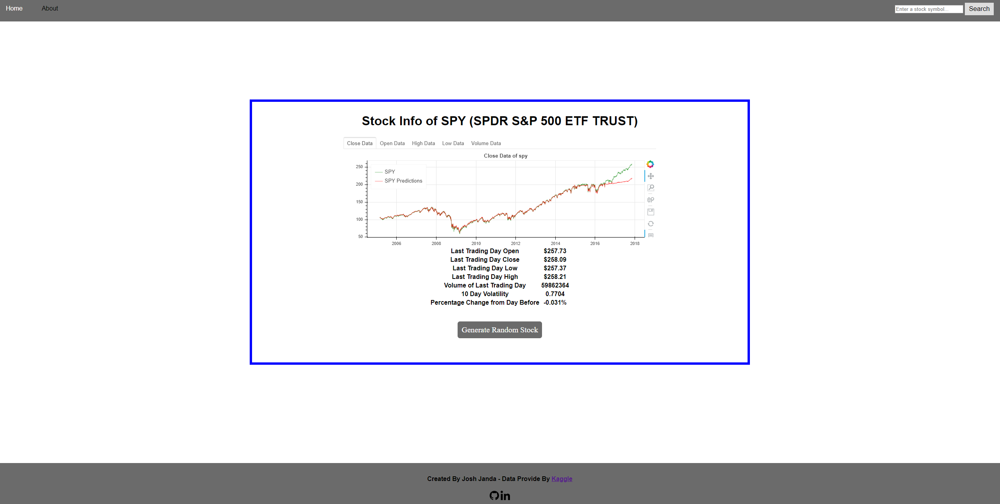

# READ ME

This django app provides visualizations and predictions on stock data.

Data can be downloaded at: https://www.kaggle.com/borismarjanovic/price-volume-data-for-all-us-stocks-etfs

Steps for setting up:

1. Clone Files
2. Download data, extract
	- Combine data in Stocks folder and ETFs folder to one main folder
3. In settings.py file, change **FILE_DIR** variable to location of stock data.
4. Run Django App.

Images of website (will be updated later on for better looking pages):

